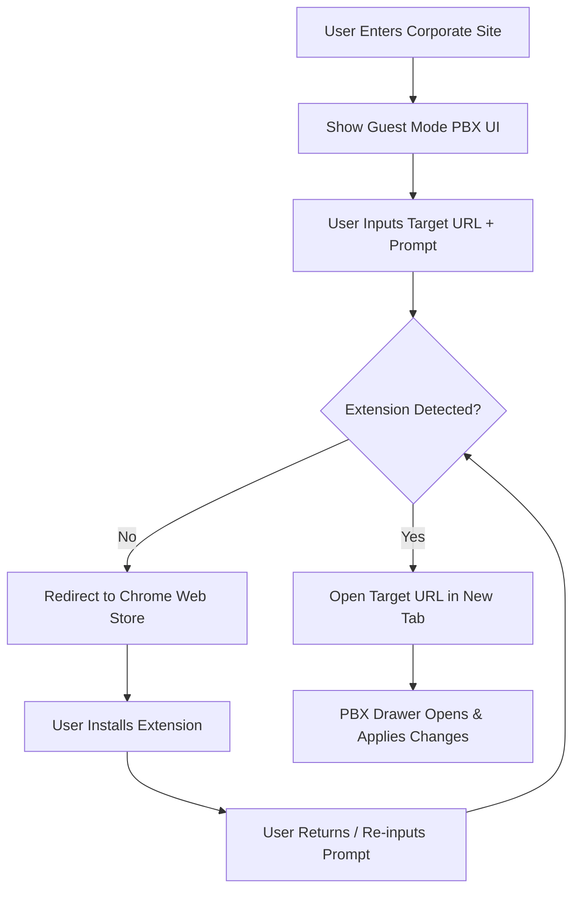

# Guest Mode User Flow (Flowchart)

This diagram maps the intended user journey for the Guest Mode on the Kameleoon corporate site.

## User Journey Overview

---

## The "Extension Mandatory" Policy

Update: Following technical review, Guest Mode now requires the Kameleoon Chrome Extension for all interactions.

### The Onboarding Flow
1. **Interactive Greeting**: Users see the PBX drawer immediately on the landing page.
2. **Context Selection**: The chat asks: *"Which website would you like to optimize today?"*
3. **The Gateway**: Upon sending a prompt, if the extension is missing, the user is redirected to the Chrome Web Store.
4. **Resumption**: After installation, the system detects the extension and automatically launches the target site with the PBX drawer active.

---

## Technical Edge Cases & Questions

1.  **3-Prompt Enforcement**: We will use `localStorage` to track indices of prompts. If a user clears cache or returns on a new device, we let them start over (as per Fred's suggestion).
2.  **Sign-up Timing**: Sign-up is triggered **after** the 3rd prompt (The "Conversion Bridge"). 
3.  **Data Retention**: To save "v1.0" complexity, we may skip historical retention in the account, but we should at least pass the last 3 prompts via URL parameters or SessionStorage to the signup page so the trial starts with those "pre-loaded".
